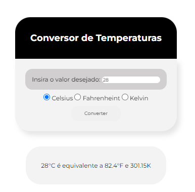

# ⛅| Convertor de Temperatura

 <p> Um simples convertor de temperatura. Com ele consegui treinar algumas coisas do <b>Java Script! </b></p>

## Indice
- [Funcionaldiade do projeto](##Funcionalidade-do-projeto)
- [UI](##UI)
- [Executar projeto](##Como-rodar)
- [Tecnologias utilizadas](##Tecnologias-utilizadas)
- [Autor](##Autor)

## Funcionalidade do projeto

- [x] Converte Celsius, Fahrenheit e Kelvin
- [x] Interface limpa e minimalista

## UI
<div align = "center">
    
</div>

<br>

## Como rodar o projeto

```bash
# Clone este repositório
$ git clone https://github.com/jefolidev/convertor-temp.git

# Acesse a pasta do proejeto no terminal
# cd convertor-temp

# Instale todas dependências
$ npm insall

# Execute a aplicação
```

## Tecnologias utilizadas 
<div align = center>

</div>

## Autor
 <span> Jeferson Franco, Desenvolvedor Full Stack </span> <a style = "text-decoration: none;" href = "https://github.com/jefolidev">  </a> <a style = "text-decoration: none;" href = "https://www.linkedin.com/in/jeferson-franco-1349062b0/">  </a>


## Atualizações futuras
- Nenhuma atualização prevista para esse projeto.
